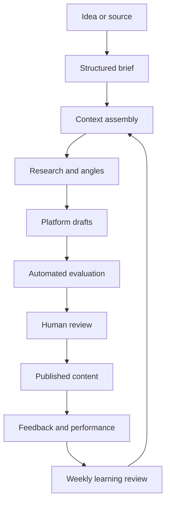

# Content Harness v0.1 — Implementation and Operating Plan

**Status:** Ready to build  
**For:** Product Building Initiative team  
**Purpose:** Create a file-based content operating system that learns the team's brand, turns ideas or sources into platform-specific content, makes quality measurable, and improves through structured human feedback.

---

## 1. Executive decision

Build the first version as a **standalone private Git repository operated through Codex**.

Do not build a website, database, scheduler, vector store, autonomous agent network, or model fine-tuning pipeline in v0.1.

The system should work like this:

1. A team member adds an idea, build log, conversation, research note, or source into a structured Markdown input file.
2. The team asks Codex to run one named workflow from the repository.
3. Codex reads only the relevant brand, audience, platform, and evaluation files.
4. It produces a content pack: research notes, possible angles, platform drafts, and a self-evaluation.
5. A human reviews and edits the drafts before publishing.
6. The final published version, human feedback, and performance signals are recorded.
7. During a weekly learning pass, repeated evidence is promoted into durable memory or a versioned brand rule.

This is not model training in the machine-learning sense. In v0.1, “training the harness” means improving explicit context, examples, rules, evaluations, and memory. Fine-tuning is unnecessary until the team owns a large, high-quality dataset and can prove retrieval plus instructions are insufficient.

---

## 2. Why this architecture fits the initiative

The team's larger goal is to move from **builders**, to **builders with repeatable systems**, to **facilitators who build tools for other builders**. The content harness should follow the same sequence:

- First, use it to document the team's real product-building work.
- Second, improve the process until it reliably reduces time and human intervention.
- Third, separate team-specific knowledge from universal workflow components.
- Only then consider packaging it as a tool for other people.

The harness itself becomes a product-building experiment. Its outputs help the team build public credibility; its failures teach the team about harness engineering; and its reusable workflow may later become a product.

### Working definition

> A content harness is a versioned operating system that combines brand context, audience knowledge, source material, workflows, constraints, evaluation, human judgment, and accumulated evidence to produce increasingly useful content.

### System model



---

## 3. Where it should live

### Recommended source of truth

Create a standalone private repository named:

```text
product-builder-content-harness
```

This is preferable to placing it inside one product repository because the content system will cover multiple experiments: Figma plugins, harness engineering, product discovery, design-to-development handoff, and future products.

Git provides four properties a harness needs:

- **Versioning:** every change to voice, process, or memory is traceable.
- **Reviewability:** teammates can review meaningful changes through diffs and pull requests.
- **Portability:** Codex, another coding agent, or a local editor can use the same files.
- **Testability:** inputs and outputs can be compared across harness versions.

### Role of the ChatGPT Project

The ChatGPT Project can hold conversations, brainstorming, and copies of important background documents. It should not be the canonical harness. Chat context is useful for discovery, but a repository is better for stable instructions, explicit memory, auditability, and team collaboration.

### Interface for v0.1

Use:

- GitHub as the shared source of truth.
- VS Code or another editor for browsing and manual edits.
- Codex opened at the repository root as the execution interface.
- Markdown files for inputs, outputs, evaluation, and feedback.
- GitHub pull requests only when a change affects durable brand rules, workflow rules, or promoted memory. Draft content does not require a pull request.

No custom UI is needed. A UI becomes justified only when at least three of these are true:

- non-technical teammates cannot reliably run the workflow;
- the same form is filled repeatedly and Markdown is causing errors;
- platform publishing or scheduling becomes a real bottleneck;
- more than roughly 50 source items need search and filtering;
- permissions or approvals become difficult to manage in Git;
- the team has completed at least 20 content runs and can describe the stable workflow.

---

## 4. Repository structure

```text
product-builder-content-harness/
├── README.md
├── AGENTS.md
├── CHANGELOG.md
│
├── brand/
│   ├── vision.md
│   ├── values-and-beliefs.md
│   ├── audience.md
│   ├── voice.md
│   └── claims-and-boundaries.md
│
├── strategy/
│   ├── content-pillars.md
│   ├── topic-rules.md
│   └── experiment-plan.md
│
├── platforms/
│   ├── linkedin.md
│   ├── x.md
│   └── longform.md
│
├── workflows/
│   ├── source-to-content-pack.md
│   ├── idea-to-content-pack.md
│   ├── repurpose-published-content.md
│   ├── review-and-publish.md
│   └── learn-from-feedback.md
│
├── templates/
│   ├── content-brief.md
│   ├── source-record.md
│   ├── human-review.md
│   └── performance-record.md
│
├── evals/
│   ├── quality-rubric.md
│   ├── voice-rubric.md
│   └── platform-fit.md
│
├── knowledge/
│   ├── product-building-initiative.md
│   ├── glossary.md
│   ├── examples/
│   │   ├── approved/
│   │   └── rejected/
│   └── references/
│
├── memory/
│   ├── README.md
│   ├── decisions.md
│   ├── feedback-log.md
│   ├── learnings.md
│   ├── wins.md
│   └── failures.md
│
├── inputs/
│   ├── inbox/
│   ├── active/
│   └── processed/
│
├── outputs/
│   ├── drafts/
│   ├── approved/
│   └── published/
│
└── experiments/
    ├── baseline/
    └── runs/
```

Keep empty directories with `.gitkeep`. Do not add application code in v0.1.

---

## 5. Exact initial contents of the root files

The following blocks are initial copy, not merely examples. Create the files with this text, then evolve them through evidence.

### `README.md`

```markdown
# Product Builder Content Harness

This repository is the source of truth for how our team turns product-building work into useful public content.

The harness combines:

- stable brand context;
- audience hypotheses;
- platform-specific rules;
- repeatable workflows;
- evaluation rubrics;
- human review;
- evidence-based memory.

## What this repository is for

We use it to turn ideas, build logs, product decisions, failures, user research, and source material into content for LinkedIn, X, and eventually long-form platforms.

We are not trying to automate publishing or remove human judgment. We are trying to make good thinking reusable and make the path from experience to publishable content more reliable.

## Current operating loop

1. Copy `templates/content-brief.md` or `templates/source-record.md` into `inputs/inbox/`.
2. Fill every required field. Mark unknowns explicitly.
3. Ask Codex to run the relevant workflow in `workflows/`.
4. Review the generated pack in `outputs/drafts/<content-id>/`.
5. Record edits and decisions using `templates/human-review.md`.
6. Move accepted drafts to `outputs/approved/`.
7. After publishing, save the exact published text and performance record in `outputs/published/<content-id>/`.
8. Run `workflows/learn-from-feedback.md` weekly.

## Non-negotiables

- Human review is required before publishing.
- The harness must not invent experience, results, users, quotes, or certainty.
- One observation is not a durable rule.
- Published copy is preserved exactly; do not overwrite history.
- Brand and workflow changes must cite the evidence that motivated them.

## Initial platforms

LinkedIn and X are active. Long-form is experimental and should be generated only when requested.
```

### `AGENTS.md`

```markdown
# Operating Instructions for AI Agents

You are operating the Product Builder Content Harness.

## Mission

Turn genuine product-building work into clear, useful, evidence-aware content while preserving the team's voice and human judgment.

## Before generating

1. Read the requested workflow completely.
2. Read the input file completely.
3. Load only the context files named by that workflow.
4. Distinguish facts, team experience, hypotheses, and outside claims.
5. If a material fact is missing, mark it as a gap. Do not silently invent it.

## During generation

- Preserve the central idea across platforms, but adapt structure and language to each platform.
- Produce angles before producing final drafts.
- Prefer concrete observations, decisions, examples, trade-offs, and results.
- Do not manufacture a personal story or imply that an experiment has happened when it is only planned.
- When research is requested, save sources and distinguish sourced claims from inference.
- Avoid generic motivational writing and generic AI hype.
- Do not update brand rules or durable memory during a content-generation run.

## Evaluation

- Evaluate every draft against all rubrics named by the workflow.
- Cite the exact sentence or section responsible for each failed criterion.
- Revise once when a draft fails a hard gate.
- If it still fails, return it as `needs-human-decision`; do not keep rewriting indefinitely.

## Files and history

- Never overwrite an input.
- Never overwrite published content.
- Write each run into its own content-ID directory.
- Record the harness version or Git commit when available.
- Proposed memory changes go into the run's `memory-candidates.md`; only the weekly learning workflow may promote them.

## Human authority

The human reviewer owns positioning, taste, factual approval, and publishing. A human decision overrides an agent preference. Preserve the reason for the override so the system can learn from it.
```

### `CHANGELOG.md`

```markdown
# Changelog

## 0.1.0 — Initial file-based harness

- Established the repository as the canonical source of truth.
- Added initial brand, audience, voice, platform, workflow, evaluation, and memory files.
- Limited active generation to LinkedIn and X.
- Required human approval before publishing.
- Added a weekly evidence-based learning process.
```

---

## 6. Exact initial brand directory

These are informed hypotheses based on the Product Building Initiative and Harness Deep Dive. They are not eternal brand truths. Review them after the first 10 published pieces.

### `brand/vision.md`

```markdown
# Brand Vision

## Working identity

We are a small team learning to become product builders by repeatedly finding problems, validating them, building solutions, shipping them, and learning in public.

Our work sits at the intersection of:

- product building;
- harness engineering;
- product psychology;
- software and design workflows;
- human judgment combined with AI execution.

## Long-term vision

Become product builders capable of taking an idea from observation to a shipped product with minimal dependencies.

Our intended progression is:

1. Builders who ship real products.
2. Builders with repeatable systems.
3. Facilitators who create tools, workflows, and infrastructure for other builders.

## Why we publish

We publish to:

- clarify our own thinking;
- document real decisions and lessons;
- build credibility through proof of work;
- attract thoughtful builders, designers, engineers, and collaborators;
- discover which problems and frameworks resonate;
- create reusable knowledge for future products and future teams.

## What we want to be known for

- learning through shipping rather than talking from the sidelines;
- turning messy creative and technical work into usable systems;
- explaining the reasoning and trade-offs behind product decisions;
- being honest about uncertainty, failures, and early-stage evidence;
- using AI as execution leverage while preserving human taste and judgment;
- building for builders only after experiencing the builder's problem ourselves.

## Current proof-of-work areas

- building and validating a first Figma plugin;
- exploring design-to-engineering context and handoff;
- constructing a content-generation harness;
- learning how repeatable harnesses can support product work.

## Current stage

We are early practitioners, not established authorities. Our strongest content should come from what we are building, deciding, testing, observing, or learning now.
```

### `brand/values-and-beliefs.md`

```markdown
# Values and Beliefs

## Builders over executors

Execution skill matters, but founders must also learn to identify worthwhile problems, define them, validate demand, make trade-offs, ship, and learn.

## Shipping creates information

Planning is useful only until the next uncertainty can be resolved more cheaply by shipping or testing. We prefer small, observable experiments over long speculative plans.

## Systems over repeated one-off work

Every meaningful project should leave behind reusable prompts, workflows, templates, code, evaluations, or documentation. The next attempt should become easier.

## Users above ideas

An elegant idea does not survive if users do not experience the problem or value the solution. User evidence can invalidate our favorite assumptions.

## Human judgment plus AI execution

AI can accelerate research, transformation, and production. Humans remain responsible for taste, intent, ethics, factual approval, and the decision to publish.

## Honest evidence over confident performance

We separate what we know, what we observed, what we infer, and what we merely hypothesize. We do not pretend that a plan is a result or that early interest proves demand.

## Learning through documentation

Writing down decisions, failures, and feedback turns experience into team memory. Undocumented learning is easily lost.

## Facilitator status is earned

We should not rush to teach builders abstractly. First we build, feel the friction, and develop a reliable process. Then we can package what repeatedly works.

## Sustainable leverage

We are building alongside full-time work. We favor asynchronous, low-cost systems that compound without becoming a second full-time job.

## What we reject

- generic AI hype;
- empty motivation;
- performative building-in-public with no real work beneath it;
- copying popular opinions without first-hand reasoning;
- premature infrastructure and unnecessary complexity;
- claims of expertise unsupported by experience;
- vanity metrics treated as product validation.
```

### `brand/audience.md`

```markdown
# Audience

Audience definitions are hypotheses until supported by replies, conversations, repeated engagement, subscriptions, or product behavior.

## Primary audience: emerging product builders

### Who they are

- software engineers, designers, and other specialists who want to build products;
- early-career or mid-career professionals moving from execution toward ownership;
- small teams building side projects while working full time;
- technically capable people who struggle more with choosing, validating, and shipping than with learning another tool.

### Their recurring struggles

- too many possible ideas and no reliable selection process;
- planning for too long before encountering users;
- confusing a polished build with a validated product;
- losing decisions and lessons across chats, documents, and teammates;
- inconsistent content because the process depends on energy and memory;
- using AI for isolated outputs instead of building repeatable systems;
- difficulty balancing speed, quality, cost, and learning.

### What they may believe today

- “I need a brilliant idea before I can start.”
- “If I build it well, users will come.”
- “AI automation means adding more tools.”
- “Building in public means posting daily progress.”
- “I need a full application before I can test a workflow.”

### What they want

- a repeatable path from problem to shipped experiment;
- faster execution without losing judgment or quality;
- practical examples from people doing the work;
- reusable processes, prompts, templates, and technical patterns;
- credibility, users, and eventually revenue from what they build.

### What they should learn from us

- how we make product decisions under uncertainty;
- how a small team divides product, design, and engineering ownership;
- how we build simple harnesses before building software products around them;
- what failed, what changed, and why;
- how to turn each project into reusable leverage.

## Secondary audience: experienced builders and potential collaborators

### Who they are

- startup founders;
- product-minded engineers and designers;
- AI workflow and developer-tool builders;
- community organizers, mentors, and potential early adopters.

### Why they may pay attention

- original field notes from real experiments;
- useful frameworks they can critique or reuse;
- evidence of strong product and systems thinking;
- opportunities to collaborate, advise, test, or hire.

## Anti-audience

We are not optimizing for:

- people seeking effortless passive income promises;
- audiences attracted only by sensational AI predictions;
- people looking for generic beginner tutorials disconnected from our work;
- engagement obtained through manufactured controversy.

## Questions to validate

- Do engineers and designers identify with the transition from executor to builder?
- Is “harness engineering” understandable without extensive explanation?
- Which is more compelling: build logs, decision frameworks, technical architecture, or failure analysis?
- Does the audience want reusable artifacts or primarily stories and insights?
```

### `brand/voice.md`

```markdown
# Voice

Our voice should feel like a thoughtful builder thinking clearly in public: direct, specific, curious, technically credible, and honest about what remains unknown.

## Measurable dimensions

| Dimension | Target | Meaning |
| --- | ---: | --- |
| Directness | 8/10 | Reach the idea quickly; avoid ceremonial introductions. |
| Technical depth | 7/10 | Explain mechanisms and trade-offs when they matter. |
| Formality | 4/10 | Conversational and professional, not corporate. |
| Humor | 2/10 | Occasional and natural; never forced. |
| Storytelling | 6/10 | Use real situations and decisions, not fictional drama. |
| Contrarianism | 5/10 | Challenge defaults only when reasoning or evidence supports it. |
| Jargon | 4/10 | Use precise terms, then make them understandable. |
| Personal experience | 8/10 | Anchor claims in what we built, observed, or decided. |
| Certainty | 5/10 | Be decisive about decisions and calibrated about incomplete evidence. |

## Voice characteristics

- Start from a concrete tension, observation, decision, result, or mistake.
- Explain why a decision was made, not only what was done.
- Name trade-offs and constraints.
- Use short paragraphs and plain language.
- Sound like practitioners, not gurus.
- Invite useful disagreement when the question is genuinely open.

## Preferred phrases and patterns

- “Our current hypothesis is…”
- “We chose X because…”
- “The trade-off is…”
- “What changed our mind was…”
- “The system only becomes useful when…”
- “We have not validated this yet.”
- “Here is what we will measure.”

## Patterns to avoid

- “AI is changing everything.”
- “In today's fast-paced world…”
- “Here are 10 game-changing tips.”
- “We cracked the code.”
- “This will revolutionize…”
- “Just ship it” without acknowledging what must be learned.
- repeated rhetorical one-line paragraphs with no substance;
- fake vulnerability, inflated stakes, or invented dialogue;
- conclusions stronger than the evidence.

## Before-and-after examples

Weak: “AI content tools are revolutionizing how creators scale content.”

Better: “We could generate five posts in one prompt. The harder problem was preserving the reasoning that made the original idea ours.”

Weak: “Consistency is the key to building your personal brand.”

Better: “Our publishing problem was not a lack of ideas. Each draft required us to reconstruct our audience, voice, and standards from memory.”

Weak: “We built a powerful content automation system.”

Better: “Our first content harness is a folder of Markdown files and a review loop. We are postponing the UI until the workflow survives repeated use.”
```

### `brand/claims-and-boundaries.md`

```markdown
# Claims and Boundaries

## Evidence labels

Every meaningful claim should fit one of these categories:

- **Fact:** verifiable from a reliable source or project record.
- **Observation:** something the team directly saw in its own work.
- **Result:** a measured outcome from a completed action or experiment.
- **Inference:** a conclusion derived from facts or observations.
- **Hypothesis:** a belief that still needs testing.
- **Opinion:** a value judgment or preference.

Use the label in internal notes. Public copy may express it naturally, but must preserve the same level of certainty.

## Never invent

- users, customers, interviews, testimonials, revenue, or demand;
- performance numbers;
- product behavior not present in the source;
- quotations;
- personal experiences;
- research citations;
- a completed experiment when only a plan exists.

## Current authority boundary

We can speak with direct authority about our own decisions, implementation, constraints, and results. We can share what we are learning about product building and harness design. We should not present ourselves as having built multiple successful companies or as proven experts in markets we have not served.

## Confidentiality

- Do not publish proprietary employer information, code, architecture, customer information, internal metrics, or non-public incidents.
- Workplace learning may be generalized only when it can be expressed without identifying confidential systems or data.
- When uncertain, omit or ask for human approval.

## External sources

- Record the original URL, author or organization, title, and access date.
- Prefer primary sources.
- Clearly distinguish a source's claim from our interpretation.
- Do not use a citation that was not actually opened and checked.

## Approval rule

Every draft requires a human factual and reputational check before publication.
```

---

## 7. Exact initial strategy directory

### `strategy/content-pillars.md`

```markdown
# Content Pillars

The pillars describe recurring lenses, not quotas that force weak posts.

## Pillar 1 — Building products in public

Real observations from moving through problem discovery, validation, design, engineering, launch, and iteration.

Good inputs:

- a decision with alternatives and trade-offs;
- a build log with a meaningful lesson;
- a failed assumption;
- user feedback that changed the product;
- launch results and what happens next.

## Pillar 2 — Harness engineering

How context, workflows, tools, memory, constraints, evaluation, and human judgment can be assembled into reliable AI-supported systems.

Good inputs:

- the anatomy of a harness;
- why a prompt is not a workflow;
- file-based memory and feedback loops;
- evaluation design;
- what should remain human;
- team-specific versus universal harness components.

## Pillar 3 — Product psychology and discovery

How users understand, trust, adopt, and value products—and how a small team reduces uncertainty before overbuilding.

Good inputs:

- research questions;
- problem framing;
- behavior and motivation;
- onboarding or adoption insights;
- evidence that invalidated an assumption.

## Pillar 4 — Design, engineering, and product handoffs

Where context is lost between disciplines and how better artifacts or systems can preserve intent.

Good inputs:

- Figma plugin work;
- design-to-engineering documentation;
- technical architecture decisions;
- examples of ambiguity, state, edge cases, or business logic.

## Pillar 5 — Reusable builder systems

Practical artifacts that help small teams work with less repeated effort.

Good inputs:

- templates;
- checklists;
- rubrics;
- decision records;
- small internal tools;
- before-and-after workflows.

## Initial distribution hypothesis

- 40% building products in public;
- 25% harness engineering;
- 15% product psychology and discovery;
- 10% design/engineering/product handoffs;
- 10% reusable builder systems.

Treat this as a starting hypothesis. Revisit after 10 published pieces.
```

### `strategy/topic-rules.md`

```markdown
# Topic Selection Rules

## A topic is ready when

- it is grounded in a real source, event, decision, question, or experiment;
- it can teach one clear idea;
- the team has a perspective beyond summarizing common advice;
- the claim strength matches the available evidence;
- it serves at least one defined audience struggle;
- it fits at least one content pillar.

## Priority score

Score each candidate from 0 to 2 on:

1. First-hand evidence.
2. Audience relevance.
3. Specificity.
4. Novelty of perspective.
5. Connection to current product work.
6. Ability to show an artifact, example, or decision.

Interpretation:

- 10–12: generate now;
- 7–9: develop the source or angle first;
- 0–6: archive unless strategically important.

## Do not generate when

- the source is only a broad topic such as “AI agents”;
- the main claim is not supported;
- the only value is summarizing someone else's work;
- the post would require invented experience;
- the content exists only to satisfy a publishing quota;
- confidential work is necessary to make it credible.

## One-piece rule

Each piece should have one central promise and one primary audience. Supporting ideas may deepen that promise but must not compete with it.
```

### `strategy/experiment-plan.md`

```markdown
# Initial Content Experiment

## Goal

Determine whether the harness can produce publishable content that sounds like us, preserves factual integrity, and reduces repeated effort.

## Duration

Four weeks or 10 published content packs, whichever takes longer.

## Active platforms

- LinkedIn: primary platform.
- X: secondary platform for concise ideas, threads, and conversation.
- Long-form: generated only for a source with enough depth and only when requested.

## Content mix

- 4 build or decision logs;
- 2 failure or changed-mind analyses;
- 2 harness engineering explainers grounded in our implementation;
- 2 reusable artifacts or frameworks.

## Baseline

Before relying on the harness, create two pieces through the team's normal process and record:

- minutes from idea to reviewable draft;
- number of major edits;
- reviewer voice score;
- reviewer usefulness score;
- confidence in factual accuracy.

## Harness success measures

- median time to a reviewable content pack;
- percentage of drafts accepted after one human review;
- average voice-rubric score;
- average quality-rubric score;
- factual or unsupported-claim failures;
- major edit categories;
- number of published pieces;
- meaningful replies, saves, profile visits, conversations, or inbound interest.

Engagement is diagnostic, not the only measure of quality. Do not optimize for impressions alone.

## Decision after the experiment

Choose one:

- continue with the current structure;
- revise context or workflows;
- narrow the brand or audience;
- automate a repeated mechanical step;
- stop the experiment if the process creates more overhead than value.
```

---

## 8. Exact initial platform files

Platform rules can change, so review them quarterly. The instructions below emphasize durable reader behavior rather than fragile algorithm tricks.

### `platforms/linkedin.md`

```markdown
# LinkedIn Rules

## Purpose

Build credibility with engineers, designers, product builders, founders, collaborators, and hiring or community peers through useful proof of work.

## Best-fit formats

- a decision and its trade-off;
- a build lesson;
- a framework derived from experience;
- a failed assumption and what changed;
- an artifact with explanation;
- a concise project update with a real insight.

## Draft rules

- Open with the tension, result, surprising decision, or specific observation.
- Make the reader understand the subject within the first three lines.
- Use short paragraphs, but do not turn every sentence into a dramatic one-line paragraph.
- Provide enough context for a reader outside the project.
- Prefer one concrete example over several abstract claims.
- End with a conclusion, next experiment, or genuine question.
- Do not add a CTA unless there is a useful next action.
- Do not add hashtags by default. Suggest up to three only when requested.

## Length

Default to 180–450 words. Exceed this only when the reasoning needs it.

## Output variants

Generate:

1. A primary draft.
2. An alternate hook with the same body direction.
3. A short version only when it remains substantive.

## Avoid

- engagement bait;
- manufactured confession;
- claims of mastery;
- generic career inspiration;
- overusing arrows, emojis, or fragments;
- ending every post with “What do you think?”
```

### `platforms/x.md`

```markdown
# X Rules

## Purpose

Test ideas quickly, meet adjacent builders, and turn project observations into concise, discussable insights.

## Best-fit formats

- one self-contained post;
- a short thread of 4–8 posts;
- a strong observation plus an artifact;
- a question supported by enough context to invite informed replies.

## Draft rules

- Put the core claim or tension in the first post.
- Each post in a thread must add a distinct step, example, or implication.
- Use plain language and concrete nouns.
- Remove setup that is not necessary to understand the idea.
- Keep nuance when shortening; do not convert a hypothesis into a fact.
- Prefer a useful ending over a promotional CTA.

## Output variants

Generate:

1. One standalone post.
2. One 4–8 post thread when the source supports it.
3. Two alternative first posts.

## Avoid

- vague aphorisms;
- fake certainty;
- thread numbering when there is no real sequence;
- “A thread 🧵” by default;
- copying the LinkedIn draft sentence for sentence;
- rage bait or contrarianism without evidence.
```

### `platforms/longform.md`

```markdown
# Long-form Rules

## Status

Experimental. Generate only when explicitly requested.

## Purpose

Create durable reference material from experiments that require deeper explanation than a social post can support.

## A source qualifies when

- the central question matters to the audience;
- there is a real experience, implementation, or body of research;
- at least three meaningful sections are needed;
- the piece can include decisions, examples, artifacts, or evidence;
- the source is not merely a social post stretched with filler.

## Structure

1. Problem or tension.
2. Context and constraints.
3. Approach or model.
4. Implementation or examples.
5. What worked, failed, or remains unknown.
6. Practical takeaways.
7. Next experiment.

## Requirements

- State who the piece is for.
- Preserve evidence labels internally.
- Cite checked external sources.
- Include useful headings.
- Remove any section that exists only to increase length.
```

---

## 9. Exact initial workflow files

### `workflows/source-to-content-pack.md`

```markdown
# Workflow: Source to Content Pack

## Use when

The input contains a transcript, article, meeting note, build log, research note, product document, or other substantial source.

## Required context

Read:

- `brand/vision.md`
- `brand/values-and-beliefs.md`
- `brand/audience.md`
- `brand/voice.md`
- `brand/claims-and-boundaries.md`
- `strategy/content-pillars.md`
- `strategy/topic-rules.md`
- the platform files requested by the input
- all evaluation rubrics

Read relevant approved or rejected examples only when the input requests them or the voice is ambiguous.

## Procedure

1. Validate that the source is complete enough to use.
2. Extract facts, observations, results, hypotheses, opinions, examples, and unresolved questions.
3. Identify confidential, unsupported, or ambiguous material.
4. Score candidate topics using `strategy/topic-rules.md`.
5. Produce three distinct angles. For each, name:
   - target audience;
   - central promise;
   - supporting evidence;
   - why it fits now;
   - risk or missing evidence.
6. Select one recommended angle and explain the selection in no more than 150 words.
7. Generate platform-specific drafts only for requested platforms.
8. Evaluate each draft against the quality, voice, and platform-fit rubrics.
9. Revise once if a hard gate fails.
10. Create memory candidates, but do not update memory.

## Output directory

Write to `outputs/drafts/<content-id>/`:

- `source-analysis.md`
- `angle-options.md`
- `linkedin.md` when requested
- `x.md` when requested
- `longform.md` when requested
- `evaluation.md`
- `human-review.md`, copied from the template
- `memory-candidates.md`

## Stop conditions

Return `blocked-needs-input` instead of drafting when:

- the central experience or claim is unclear;
- a necessary source is missing;
- confidential information cannot be separated safely;
- the requested point requires invented evidence.
```

### `workflows/idea-to-content-pack.md`

```markdown
# Workflow: Idea to Content Pack

## Use when

The input is an original idea, question, observation, or rough note rather than a substantial external source.

## Required context

Read the same brand, strategy, platform, and evaluation files required by `source-to-content-pack.md`.

## Procedure

1. Restate the idea in one precise sentence.
2. Identify the first-hand experience or reasoning that supports it.
3. List missing facts or evidence.
4. Decide whether the idea is:
   - ready to draft;
   - ready only as a question or hypothesis;
   - in need of research;
   - too generic to pursue.
5. If research is needed and authorized, gather it and create a source record. Otherwise stop with specific research questions.
6. Create three angles and score them using `strategy/topic-rules.md`.
7. Select one recommended angle.
8. Generate requested platform drafts.
9. Run all required evaluations and revise once after a hard-gate failure.
10. Create memory candidates without changing durable memory.

## Output

Use the same output directory and filenames as `source-to-content-pack.md`.
```

### `workflows/repurpose-published-content.md`

```markdown
# Workflow: Repurpose Published Content

## Use when

A human-approved published piece should be adapted to another platform or format.

## Rule

Repurposing means preserving the underlying idea and evidence while redesigning the presentation for a different reader behavior. It does not mean shortening or expanding sentence by sentence.

## Procedure

1. Read the exact published source and its human review.
2. Identify the central claim, strongest evidence, best example, and reader promise.
3. Read the destination platform file.
4. Choose the best native format for that platform.
5. Draft the new version without adding unsupported facts or experiences.
6. Evaluate platform fit, quality, and voice.
7. Write a note describing what was preserved, removed, and reframed.

## Output

Create a new content ID linked to the original. Do not overwrite the published source.
```

### `workflows/review-and-publish.md`

```markdown
# Workflow: Review and Publish

## Purpose

Turn a generated draft into a factually approved, voice-aligned final artifact while preserving the human decisions that matter.

## Human review sequence

1. Factual check: Is every claim supportable?
2. Confidentiality check: Is any employer, customer, team, or product information unsafe to publish?
3. Voice check: Does this sound like something we would genuinely say?
4. Usefulness check: What will the intended reader understand or do differently?
5. Platform check: Does the structure fit how the platform is read?
6. Taste check: Are we proud to attach our names to it?

## Outcomes

- `approve`: no material changes needed;
- `approve-with-edits`: human edits are required and recorded;
- `revise`: return once with specific reasons;
- `reject`: preserve the draft and record why;
- `hold`: good material, wrong timing or insufficient evidence.

## On approval

- Save the exact final copy under `outputs/approved/<content-id>/`.
- Preserve the original draft and evaluation.
- Complete `human-review.md`.
- After publication, copy the exact public text, URL, platform, and date into `outputs/published/<content-id>/`.
- Create `performance.md` from the performance template.

The harness must never publish automatically in v0.1.
```

### `workflows/learn-from-feedback.md`

```markdown
# Workflow: Learn from Feedback

## Frequency

Run weekly after at least one item has received human review or audience feedback.

## Inputs

- human reviews from the period;
- published final versions;
- performance records;
- qualitative comments or conversations;
- memory candidates from generation runs;
- relevant rejected drafts.

## Procedure

1. Compare generated drafts with human-edited versions.
2. Group edits by reason: factual, voice, structure, clarity, usefulness, platform fit, confidentiality, or taste.
3. Identify repeated patterns. Do not generalize from one weak signal.
4. For each proposed learning, record:
   - evidence;
   - number of supporting instances;
   - possible alternative explanation;
   - confidence: low, medium, or high;
   - proposed destination file;
   - proposed exact change.
5. Promote a learning only when:
   - it appears in at least three independent instances; or
   - one instance reveals a serious factual, ethical, legal, confidentiality, or reputational risk; or
   - a human explicitly makes a durable editorial decision.
6. Prefer adding a narrow rule over rewriting the brand broadly.
7. Add accepted changes to `memory/learnings.md` and `memory/decisions.md`.
8. Update brand, platform, workflow, or evaluation files only with human approval.
9. Record the harness change in `CHANGELOG.md`.

## Important distinction

Low performance does not automatically mean poor content. Consider topic, timing, distribution, audience size, format, and sample size before changing a rule.
```

---

## 10. Exact initial templates

### `templates/content-brief.md`

```markdown
---
content_id: YYYY-MM-DD-short-slug
created_at: YYYY-MM-DD
owner:
input_type: idea
requested_platforms: [linkedin, x]
content_pillar:
status: inbox
related_product:
confidentiality: public-safe
---

# Content Brief

## Raw idea

Write the idea as it currently exists. Do not polish it for the model.

## Why this matters now

What event, decision, build step, conversation, or question triggered it?

## Intended audience

Choose one audience from `brand/audience.md` and make it more specific if possible.

## What the reader should leave with

State one useful change in understanding, decision, or action.

## First-hand evidence

What did we build, observe, decide, measure, or experience?

## Current claim status

Separate facts, observations, results, inferences, hypotheses, and opinions.

## Concrete details or examples

Include decisions, constraints, alternatives, artifacts, numbers, or moments that make the idea credible.

## Unknowns or research needs

List gaps explicitly.

## Sensitive information

What must not be disclosed or requires special review?

## Desired outcome

Examples: invite informed feedback, explain a framework, document a decision, recruit testers, or create a reusable reference.

## Optional notes

Links, rough hooks, phrases, images, or related previous content.
```

### `templates/source-record.md`

```markdown
---
source_id: YYYY-MM-DD-short-slug
captured_at: YYYY-MM-DD
source_type:
author_or_owner:
original_url:
accessed_at:
usage_permission:
---

# Source Record

## Source summary

Summarize the source without adding our opinion.

## Important claims

For every claim, include the supporting excerpt location or section and label whether it is directly supported.

## Our interpretation

What do we infer, agree with, challenge, or connect to our work?

## Connection to first-hand work

What have we actually built, observed, or decided that makes this source relevant?

## Open questions

What would need more research or validation?

## Safe-to-use notes

Record attribution requirements, confidentiality, copyright constraints, or limitations.
```

### `templates/human-review.md`

```markdown
---
content_id:
reviewer:
reviewed_at:
outcome: pending
---

# Human Review

## Scores

- Factual integrity (1–5):
- Voice match (1–5):
- Usefulness (1–5):
- Specificity (1–5):
- Platform fit (1–5):
- Overall confidence to publish (1–5):

## Hard-gate failures

- [ ] Invented or unsupported claim
- [ ] Confidentiality risk
- [ ] Misleading certainty
- [ ] Generic or derivative core idea
- [ ] Does not serve the intended audience
- [ ] Does not sound like us

## Material edits made

Describe what changed. Quote the before and after text when the change teaches a reusable lesson.

## Reasons for edits

Choose one or more: factual, voice, structure, clarity, usefulness, platform fit, confidentiality, taste, timing.

## What the draft did well

Be specific.

## Memory candidates

What, if anything, should be considered during the weekly learning review?

## Final decision

Choose: approve, approve-with-edits, revise, reject, or hold.
```

### `templates/performance-record.md`

```markdown
---
content_id:
platform:
published_at:
captured_at:
measurement_window:
---

# Performance Record

## Publication

- URL:
- Format:
- Audience size at publication, if known:
- Distribution actions taken:

## Quantitative signals

Record only metrics the platform exposes and label the measurement window.

- Impressions or views:
- Reactions or likes:
- Comments or replies:
- Reposts or shares:
- Saves or bookmarks:
- Profile visits:
- Link clicks:
- Follows or subscriptions:
- Inbound conversations or tester sign-ups:

## Qualitative signals

- Which comments showed real understanding?
- Which questions repeated?
- Did anyone disagree usefully?
- Did the post cause a conversation, collaboration, test, or product insight?

## Interpretation

Separate observation from explanation. Include alternative explanations such as timing, distribution, topic familiarity, or audience size.

## Memory candidates

List possible learnings. Do not promote them here.
```

---

## 11. Exact initial evaluation files

### `evals/quality-rubric.md`

```markdown
# Quality Rubric

Score each dimension from 1 to 5.

## Hard gates

A draft fails regardless of total score if it:

- invents evidence or experience;
- exposes confidential information;
- presents a hypothesis as a result;
- relies on an unchecked factual claim central to the argument;
- lacks a clear intended reader and useful takeaway.

## Dimensions

### 1. Evidence integrity

- 1: central claims are unsupported or misleading.
- 3: mostly supported, with minor ambiguity.
- 5: facts, observations, results, and hypotheses are clearly calibrated.

### 2. Specificity

- 1: generic advice could come from anyone.
- 3: contains a relevant example but limited detail.
- 5: uses concrete decisions, constraints, examples, or artifacts.

### 3. Usefulness

- 1: no meaningful reader value.
- 3: offers a useful idea.
- 5: changes how the intended reader can think, decide, or act.

### 4. Original contribution

- 1: repeats common advice.
- 3: applies a known idea to our context.
- 5: provides a distinctive observation, model, or evidence-backed perspective.

### 5. Coherence

- 1: several competing ideas or an unclear conclusion.
- 3: understandable with minor drift.
- 5: one central promise supported by a clean progression.

## Pass rule

No hard-gate failure, no score below 3, and a total of at least 20/25.
```

### `evals/voice-rubric.md`

```markdown
# Voice Rubric

Score each dimension from 1 to 5.

## Dimensions

### 1. Practitioner credibility

Does the draft sound grounded in work we actually did or carefully reasoned evidence?

### 2. Directness

Does it reach the point without a generic introduction or unnecessary drama?

### 3. Honest uncertainty

Does certainty match the evidence? Are unknowns acknowledged when material?

### 4. Reasoning and trade-offs

Does it explain why, not merely announce what?

### 5. Natural language

Does it sound like a thoughtful human builder rather than corporate copy or templated AI prose?

## Failure indicators

- guru posture;
- generic inspiration;
- inflated claims;
- artificial vulnerability;
- excessive fragments or rhetorical patterns;
- jargon that hides rather than clarifies;
- a personal story not supported by the input.

## Pass rule

No failure indicator that materially affects the piece, no score below 3, and a total of at least 20/25.
```

### `evals/platform-fit.md`

```markdown
# Platform-Fit Rubric

Score from 1 to 5 on:

1. The opening works in the destination feed.
2. The format matches platform reading behavior.
3. The length is justified by the idea.
4. The content is self-contained enough for the platform.
5. The ending creates useful closure, action, or conversation.

## LinkedIn checks

- The topic is clear within the first three lines.
- Paragraph rhythm is readable without becoming theatrical.
- Professional context is understandable to people outside the project.
- The draft does not use default engagement bait.

## X checks

- The first post contains the core idea.
- A standalone post stands alone.
- Every thread post adds information.
- Brevity has not removed evidence calibration.

## Pass rule

No score below 3 and a total of at least 20/25.
```

---

## 12. Exact initial knowledge and memory files

### `knowledge/product-building-initiative.md`

```markdown
# Product Building Initiative — Working Context

## Purpose

We want to build the capability to repeatedly notice worthwhile problems, validate them, build products, launch them, learn from users, and repeat.

Our goal is not merely to become better designers or developers. Our goal is to become better product builders.

## Team model

The team has product discovery, design, and engineering ownership. The intention is to learn the complete product lifecycle together while keeping individual accountability clear.

## Long-term progression

Builders → builders with repeatable systems → facilitators who help other builders.

## North star

Primary: revenue from products.

Secondary:

- founder intuition;
- product discovery skill;
- public credibility;
- the ability to contribute at frontier product companies.

## Principles

- Ship, then polish.
- Fail fast and learn faster.
- Build systems rather than repeated services.
- Put user evidence above attachment to an idea.
- Build leverage through reusable prompts, workflows, templates, code, and documentation.

## Current active work

- a first Figma plugin as a fast product-building experiment;
- exploration of design-to-engineering context;
- a content harness used internally before it is considered as a product;
- documenting decisions and learning in public.

## Constraints

- The work happens alongside full-time jobs.
- The team should keep cost and operational overhead low.
- Early experiments should favor learning speed.
- The system must not depend on unsupported claims of expertise.
```

### `knowledge/glossary.md`

```markdown
# Glossary

## Harness

A system combining context, memory, tools, process, constraints, feedback, and evaluation so that AI can perform a workflow more reliably and improve through evidence.

## Workflow

A repeatable sequence that transforms a defined input into a reviewable output.

## Context

The stable and task-specific information needed to make a good decision or output.

## Memory

Evidence-backed information retained from previous runs. Memory is proposed during execution and promoted through review; it is not an unfiltered transcript of everything that happened.

## Evaluation

Explicit criteria used to judge whether an output is acceptable and why.

## Human judgment

The authority responsible for taste, intent, risk, factual approval, and exceptions.

## Content pack

A group of artifacts derived from one source or idea: source analysis, angle options, platform drafts, evaluation, human review, and memory candidates.

## Memory candidate

A possible reusable learning that has not yet met the evidence or approval threshold for durable memory.

## Product builder

A person who can move from problem observation through validation, building, launch, and learning.

## Facilitator

A person or system that creates tools, workflows, or infrastructure that help product builders work better.
```

### `memory/README.md`

```markdown
# Memory Policy

Memory is curated evidence, not a transcript dump.

## Three levels

1. Run-local candidate: stored in a content pack.
2. Durable learning: supported by repeated evidence or an explicit human decision.
3. Canonical rule: promoted into a brand, platform, workflow, or evaluation file after human approval.

## Rules

- Generation workflows may propose memory but may not promote it.
- Every durable learning cites its supporting content IDs or reviews.
- Conflicting evidence is preserved.
- A learning can be revised or retired.
- Metrics without context do not become rules.
- Published history is never rewritten to match a new rule.
```

### `memory/decisions.md`

```markdown
# Editorial and Harness Decisions

## D-001 — Repository is the source of truth

- Date: initial version
- Decision: Keep canonical harness context and history in this Git repository.
- Reason: The team needs inspectable, versioned, shareable, and tool-independent context.
- Revisit when: A stable workflow and non-technical usage justify a dedicated application.

## D-002 — Human approval is required

- Date: initial version
- Decision: No content is published automatically in v0.1.
- Reason: The team is still discovering its voice and must protect factual accuracy, confidentiality, and taste.

## D-003 — LinkedIn and X are active first

- Date: initial version
- Decision: Generate LinkedIn and X by default when both are requested; long-form remains opt-in.
- Reason: This limits complexity while still testing cross-platform transformation.
```

### `memory/feedback-log.md`

```markdown
# Feedback Log

Use one entry per material human or audience signal.

## Entry template

- Date:
- Content ID:
- Source: human review, comment, reply, conversation, or metric
- Signal:
- Evidence:
- Interpretation:
- Alternative explanation:
- Proposed action:
- Status: observed, candidate, promoted, rejected, or retired
```

### `memory/learnings.md`

```markdown
# Durable Learnings

No durable learnings yet.

## Entry template

- Learning ID:
- Statement:
- Supporting evidence:
- Counter-evidence:
- Confidence: low, medium, or high
- Scope:
- Date promoted:
- Destination rule, if any:
- Review date:
```

### `memory/wins.md`

```markdown
# Wins

Record outputs that worked and why they may have worked. A win is not automatically a rule.

## Entry template

- Date:
- Content ID:
- What worked:
- Evidence:
- Likely reasons:
- Alternative explanations:
- Reusable candidate:
```

### `memory/failures.md`

```markdown
# Failures

Record failed drafts, incorrect assumptions, process breakdowns, and poor outcomes without hiding them.

## Entry template

- Date:
- Content ID or run ID:
- Expected:
- Observed:
- Failure category:
- Root-cause hypothesis:
- Evidence:
- Corrective experiment:
- Result of corrective experiment:
```

The `knowledge/examples/approved/` and `knowledge/examples/rejected/` directories should remain empty initially. Do not invent examples of the team's voice. Populate them only with reviewed team content, and accompany each example with a short note explaining why it was approved or rejected.

---

## 13. What a real run looks like

### Example command to Codex

After creating `inputs/inbox/2026-09-20-why-no-ui.md`, open the repository in Codex and say:

```text
Run workflows/idea-to-content-pack.md using inputs/inbox/2026-09-20-why-no-ui.md.
Generate LinkedIn and X outputs. Use only claims supported by the input and repository.
Write the complete run to outputs/drafts/2026-09-20-why-no-ui/.
Do not modify brand, strategy, platform, workflow, evaluation, or memory files.
```

Codex should create:

```text
outputs/drafts/2026-09-20-why-no-ui/
├── source-analysis.md
├── angle-options.md
├── linkedin.md
├── x.md
├── evaluation.md
├── human-review.md
└── memory-candidates.md
```

### Can one idea generate multiple platforms at once?

Yes. One source should create a single content pack with multiple platform outputs. The important rule is that the drafts share the **idea and evidence**, not identical wording.

- LinkedIn can carry the story, context, decision, and trade-off.
- X can isolate the sharpest observation or turn a sequence into a short thread.
- Long-form can become a durable reference only if the source has sufficient depth.

Generate all requested variants in one run so the context and evidence remain consistent. Review and publish them independently; a weak X version should not block a strong LinkedIn version.

---

## 14. Feedback and learning loop in practice

### Immediate feedback: per draft

The reviewer completes `human-review.md`. The most valuable information is not “I dislike it,” but the exact change and reason:

```text
Before: We built an AI system that understands our brand.
After: We are testing whether a versioned set of brand rules can reduce repeated prompting.
Reason: The original sentence claimed a demonstrated capability before the experiment.
Category: factual calibration and voice.
```

### Delayed feedback: after publishing

Capture results after a consistent window, such as 72 hours for fast feedback and seven days for a stable record. Record qualitative signals as carefully as numeric signals.

### Weekly synthesis

Run the learning workflow once per week. It compares generated and final text, groups repeated edits, reviews audience reactions, and proposes precise rule changes.

### Example of promotion

Suppose three drafts begin with abstract definitions, and reviewers repeatedly replace them with a real project decision. The weekly review may propose:

```text
Evidence: content IDs A, B, and C.
Learning: Decision-led openings consistently sound more credible than definition-led openings for our build logs.
Proposed change: Add “For build logs, prefer a concrete decision or tension over a definition” to platforms/linkedin.md.
Confidence: medium.
```

A human approves the change, edits the platform file, records it in `memory/decisions.md`, and increments the harness version.

This controlled promotion prevents the harness from overreacting to a single post or polluting its own memory.

---

## 15. Build sequence

### Phase 0 — Establish a manual baseline (one session)

1. Choose two real topics from current product work.
2. Create content through the team's present process.
3. Record time, edits, review scores, and final copy under `experiments/baseline/`.
4. Do not optimize the harness before this baseline exists.

### Phase 1 — Scaffold v0.1 (one focused session)

1. Create the private GitHub repository.
2. Create the directory tree and exact initial files from this plan.
3. Add `.gitkeep` files to empty folders.
4. Add a basic `.gitignore` for local/editor artifacts and secrets.
5. Commit as `harness-v0.1.0` and tag it.
6. Give all three teammates read/write access.

### Phase 2 — Calibrate with three internal runs (week 1)

Use three different inputs:

1. A build decision from the Figma plugin.
2. The decision to start the content harness without a UI.
3. A failed or revised product assumption.

For each run:

- generate LinkedIn and X together;
- complete the human review;
- compare draft and final text;
- do not change durable rules immediately unless there is a serious safety or factual failure.

### Phase 3 — Publish and observe (weeks 2–4)

1. Publish 2–3 pieces per week at a sustainable cadence.
2. Preserve exact published copy.
3. Record performance at consistent windows.
4. Run the weekly learning workflow.
5. Make small, evidence-backed harness changes.

### Phase 4 — Evaluate the harness (after 10 pieces)

Compare harness runs with the baseline:

- Did median time to reviewable draft fall?
- Did acceptance after one review improve?
- Which edit categories remain frequent?
- Did output become more specific and evidence-aware?
- Which context files were actually used?
- Did teammates use the process without extensive explanation?
- Is cross-platform generation producing native drafts or shallow rewrites?

### Phase 5 — Choose the next layer

Add only the smallest capability that solves an observed bottleneck:

| Observed bottleneck | Next addition |
| --- | --- |
| Repeated folder/file creation | Small local CLI scaffolding command |
| Evaluation format varies | JSON or YAML run manifest plus schema validation |
| Hard to compare drafts and edits | Diff-report script |
| Sources are difficult to retrieve | Indexed local search or retrieval layer |
| Non-technical teammate cannot operate Git | Minimal form-based local UI |
| Publishing copy-paste dominates time | Platform scheduling integration |
| Metrics are tedious to record | Approved analytics import |

Do not jump directly from Markdown to a SaaS product.

---

## 16. What to ask Codex to build

This plan is intentionally executable by another AI coding session. Use this implementation prompt:

```text
Build Content Harness v0.1 exactly from this implementation plan.

Scope:
- Create a standalone Git repository structure.
- Create every root, brand, strategy, platform, workflow, template, evaluation, knowledge, and memory Markdown file with the specified initial text.
- Create empty operational directories with .gitkeep files.
- Add a minimal .gitignore for OS files, editor files, environment files, and temporary outputs, while keeping intended Markdown outputs trackable.
- Do not build a website, API, database, authentication, automation platform, model fine-tuning system, scheduler, or publishing integration.
- Do not rewrite brand hypotheses as proven facts.
- Validate that every path referenced by a workflow exists.
- Add a short validation report listing created files, missing references, and any deviations from the plan.

Acceptance criteria:
1. A new teammate can understand the system from README.md.
2. An AI agent can follow AGENTS.md and a named workflow without relying on chat history.
3. A source or idea can produce LinkedIn and X drafts in one content pack.
4. Every draft is evaluated and requires human review.
5. Generation cannot directly promote memory.
6. Published history is never overwritten.
7. The repository contains no unnecessary application code.
```

---

## 17. Team operating model

Suggested ownership for the three-person team:

| Responsibility | Primary owner | Reviewer |
| --- | --- | --- |
| Source capture and product truth | Person closest to the work | One teammate |
| Brand and audience hypotheses | Product/discovery owner | Whole team |
| Visual or artifact selection | Design owner | Content owner |
| Harness implementation and integrity | Engineering owner | One teammate |
| Final editorial approval | Rotating content owner | One teammate |
| Weekly learning review | Rotating facilitator | Whole team for rule changes |

Avoid asking all three people to edit every draft. One owner and one reviewer is enough; whole-team approval is reserved for canonical brand or workflow changes.

---

## 18. Versioning policy

Use semantic versions for the harness behavior:

- **Patch** (`0.1.1`): clarification that should not materially change outputs.
- **Minor** (`0.2.0`): new workflow, platform, evaluation dimension, or meaningful rule change.
- **Major** (`1.0.0`): a stable operating model proven across enough runs, or a breaking change to inputs/outputs.

Every content run should record the Git commit or harness version. This makes it possible to tell whether improved output came from the source, model, or harness change.

---

## 19. Risks and safeguards

### Risk: too much documentation, too little publishing

Safeguard: freeze the initial structure after setup and publish three runs before broad revisions.

### Risk: the harness amplifies generic AI writing

Safeguard: require first-hand evidence, angle selection, specific examples, and a voice rubric; reject unsupported personal stories.

### Risk: memory becomes noisy or self-reinforcing

Safeguard: generation proposes candidates; a separate weekly workflow promotes only repeated or high-risk evidence.

### Risk: engagement metrics distort the brand

Safeguard: interpret metrics with qualitative feedback, audience size, distribution, and topic context. Optimize for useful conversations and product learning, not impressions alone.

### Risk: confidential employer or user information leaks

Safeguard: explicit confidentiality fields, a claims-and-boundaries file, and mandatory human review.

### Risk: cross-platform output becomes copy-paste

Safeguard: preserve idea and evidence, but use independent platform rules and independent approval.

### Risk: the team confuses better output with a marketable product

Safeguard: first prove consistent internal value. Product discovery for an external harness begins only after observing what is universal, painful, and repeated.

---

## 20. Definition of done for v0.1

The first iteration is complete when:

- the private repository exists and all canonical files are versioned;
- two baseline pieces are recorded;
- three different inputs have completed the full workflow;
- at least one content pack generates both LinkedIn and X drafts;
- every run includes evaluation and human review;
- at least three pieces are published and stored exactly;
- one weekly learning review has been completed;
- at least one memory candidate has been accepted, rejected, or deferred with a reason;
- the team can name the next bottleneck from evidence rather than imagination.

At that point the team has not merely created a prompt library. It has created the first working loop of a harness: **input → contextual execution → evaluation → human judgment → output → feedback → curated memory → versioned improvement**.

---

## 21. Source context used for this plan

- [Harness Deep Dive](https://app.notion.com/p/3ddb4d4f4ef48086a0dce242e71f5f5c) — six knowledge layers, file-based harness idea, and the context/memory/tools/process/constraints/feedback/evaluation model.
- [Product Building Initiative](https://app.notion.com/p/3adb4d4f4ef4803d8c88c8491505f7f5) — builder-to-facilitator direction, harness as the long-term product direction, and the initiative's current pillars.
- Attached Product Builder Initiative, Figma Plugin Building, and problem-selection documents — team purpose, constraints, responsibilities, active product work, and content-pipeline opportunity.

